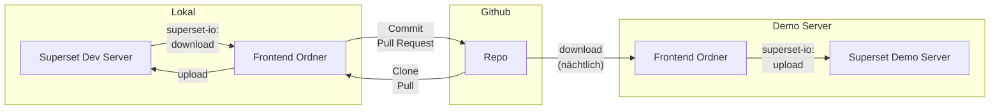

# Superset Import/Export

Convenience-wrapper around superset's REST API to download and upload snapshots of all assets.

## Getting Started

1. Install [uv](https://docs.astral.sh/uv/getting-started/installation/)
2. Install Superset IO as tool

```bash
# macOS, Linux
curl -LsSf https://astral.sh/uv/install.sh | sh

# Windows
powershell -ExecutionPolicy ByPass -c "irm https://astral.sh/uv/install.ps1 | iex"


# uv tool provides global cli, creates an isolated environment
uv tool install git+https://github.com/linkFISH-Consulting/coasti_superset_io
```

To avoid entering your credentials on every import or export, you can set them as environment variables. Passwords are best placed into files so they dont appear in the history: Create a file `~/path/to/mypass` that only holds the password.

```bash
# Linux
export SUPERSET_BASE_URL="https://superset-demo.example.com"
export SUPERSET_USER="user@example.com"
export SUPERSET_PASSWORD_FILE="~/path/to/mypass"

# Windows (Powershell)
$env:SUPERSET_BASE_URL="https://superset-demo.example.com"
$env:SUPERSET_USER="user@example.com"
$env:SUPERSET_PASSWORD_FILE="~/path/to/mypass"
```

```bash
superset-io --help

superset-io test

superset-io download ~/path/to/save/at

superset-io explore ~/path/to/save/at list
superset-io explore ~/path/to/save/at graph
```

## Superset Frontend Development Workflow

The aim of this tool is a _code-first_ approach to Frontend development.
Therefore, the ground truth is not what you see in superset, but what lives as yaml files in the Frontend Folder in the source control, e.g. Github.

This allows automatic and versioned rollouts:




## Contribution

1. Install the required dependencies (including dev, test dependencies and all optional dependencies)

```bash
uv sync --all-groups --all-extras
```

2. Make your changes in a new branch.

```bash
git checkout -b my-feature-branch
```

- Write code
- Add or update tests as needed
- Update documentation if your changes affect the public API

3. Ensure code meets quality standards.

```bash
# Activate the virtual environment first
source ./.venv/bin/activate

# Check code style and formatting
ruff check . --fix
ruff format .

# Run type checking
mypy .
```

If this looks tedious you may alternatively install the
pre-commit hooks to automatically enforce code quality standards before each commit (this runs the commands above automatically).

```bash
# Install the git hooks
pre-commit install
```

Once installed, every `git commit` will trigger automatic formatting with ruff, type checking with mypy, and linting. If you need to skip these checks (e.g., for a work-in-progress commit), use `git commit --no-verify`.

4. Make sure all tests run successfully

```bash
pytest
```

Optionally you can make sure the integrations tests also running successfully. This needs
docker compose to be installed on the system.

```bash
# Either let pytest stop start the container
pytest --integration
# Or do it manually
cd ./tests/integration
docker compose up
pytest --integration
```

5. Commit your changes with clear messages.

```bash
git add .
git commit -m "Add feature X"
```
